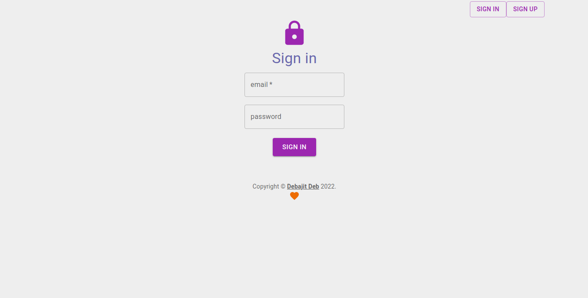
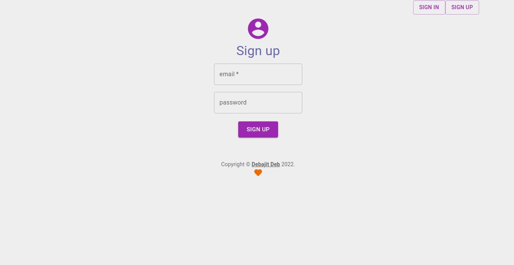
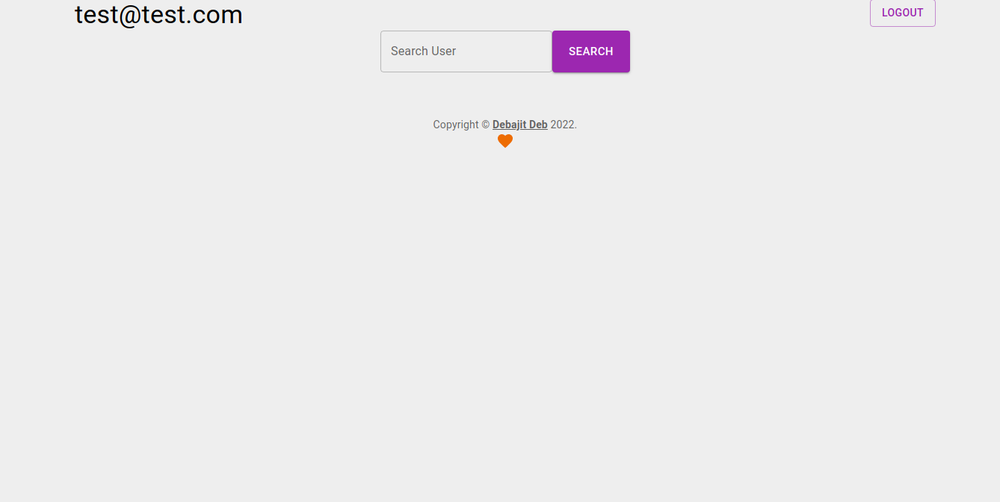
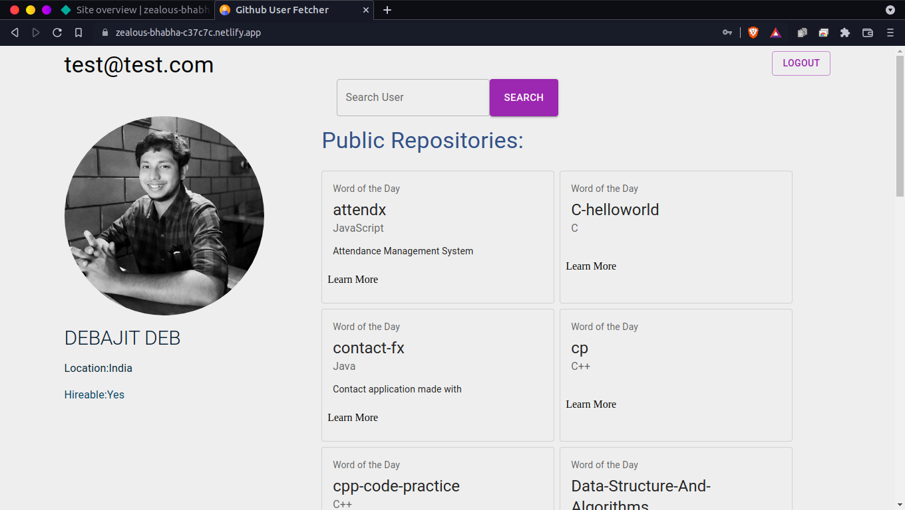

# Github User Fetcher

Allows us to fetch user profile and their Public non-forked repositories

## Features

- Sign in (Using Firebase authentication)
- Build using react for smooth experience

## Screenshot

